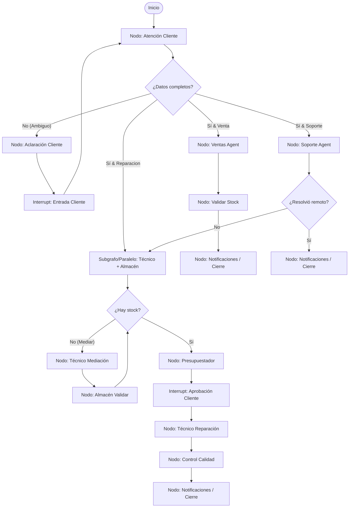

# Propuesta de Remake con LangGraph: Sistema Multiagente TechServ

Este documento presenta un análisis detallado del comportamiento, flujos y arquitectura del proyecto original **TechServ**, junto con una hoja de ruta técnica completa y diseño arquitectónico para reconstruir el sistema utilizando **LangGraph** (de LangChain).

---

## 1. Comprendiendo el Comportamiento del Proyecto Antiguo

El proyecto actual implementa un Swarm/Multiagente simulado en Python usando heurísticas, expresiones regulares y un bucle de orquestación centralizado.

### Componentes Clave Actuales
1. **Shared Memory (Estado Compartido)**: Un objeto central (`SharedMemory`) que almacena el estado completo del ticket (`cliente`, `tipo_solicitud`, `equipo`, `diagnostico`, `inventario`, `estado_ticket` e `historial_conversacion`). Cuenta con validación estricta recursiva mediante un esquema JSON.
2. **Event Bus (MCP Events)**: Un bus de eventos en el que los agentes publican y se suscriben a hitos importantes (ej. `ticket.creado`, `diagnostico.completado`, `venta.procesada`). Valida que los mensajes cumplan con el protocolo MCP.
3. **Swarm (Paralelismo)**: Ejecución paralela real mediante hilos (`ThreadPoolExecutor`) para que el Técnico y el Almacén actúen simultáneamente al crearse un ticket de reparación.
4. **Esquema de Jerarquías**: Un mecanismo de resolución de conflictos para escrituras simultáneas en memoria donde el rol con mayor prioridad prevalece (`Orquestador > Técnico > Almacén...`).

### Flujo Operativo de los Casos de Uso
- **Caso 1 (Normal — Reparación)**: Entrada ➔ Clasificación (Reparación) ➔ Swarm Técnico/Almacén (Disponible) ➔ Presupuesto ➔ Aprobación del Cliente ➔ Reparación ➔ Control de Calidad (QC) ➔ Entrega.
- **Caso 2 (Edge Case — Mediación de Stock)**: Almacén detecta falta de stock ➔ Orquestador activa ciclo de mediación ➔ Técnico sugiere alternativa (RAM 16GB) ➔ Almacén valida stock de alternativa ➔ Aprobación de nuevo costo ➔ Flujo normal.
- **Caso 3 (Venta Directa)**: Entrada ➔ Clasificación (Venta) ➔ Recomendación dinámica de Ventas con IA (descuento) ➔ Reserva en Almacén ➔ Notificación.
- **Caso 4 (Soporte Técnico Lineal)**: Entrada ➔ Clasificación (Soporte) ➔ Diagnóstico Remoto ➔ Éxito (se cierra) o Fallo (escala a flujo de Reparación).
- **Caso 5 (Adversarial — Multiturno)**: Entrada ambigua ("no anda") ➔ Atención al Cliente detecta falta de datos ➔ Solicita aclaración interactiva ➔ Segunda entrada complementa los slots ➔ Creación exitosa de Ticket de Reparación.

---

## 2. Lo Importante y Consideraciones Críticas para el Remake

Para desarrollar un remake exitoso y profesional, se deben preservar y mejorar los siguientes pilares técnicos:

1. **Estado Consistente y Centralizado (State)**: Reemplazar `SharedMemory` por el estado nativo de LangGraph (`State`).
2. **Validación Estricta de Esquemas**: Mantener validaciones robustas de entrada y salida mediante **Pydantic** para evitar alucinaciones de los LLMs.
3. **Ciclos y Bucles de Retroalimentación (Loops)**: LangGraph brilla precisamente aquí. La mediación de repuestos y las aclaraciones multiturno se deben modelar como ciclos/aristas condicionales explícitas en el grafo, no como lógica imperativa (`if/while`) dentro del orquestador.
4. **Interrupción Humana (Human-in-the-loop)**: Reemplazar las aprobaciones automáticas simuladas por puntos de interrupción reales de LangGraph (`interrupt`), permitiendo que el cliente o el administrador aprueben presupuestos de forma asíncrona.
5. **Persistencia y Memoria a Largo Plazo**: Usar `SqliteSaver` o `MemorySaver` de LangGraph para guardar el historial de las sesiones de los tickets de forma nativa.

---

## 3. Arquitectura del Remake con LangGraph

En LangGraph, la lógica del **Orquestador** ya no requiere un agente centralizado que llame manualmente a funciones; en su lugar, se define mediante la **estructura del Grafo** (Nodos y Aristas Condicionales).

### Diseño del Grafo de Estado (StateGraph)



### Definición del Estado Global (`State`)

Utilizaremos Pydantic para garantizar que la memoria compartida del ticket mantenga los mismos esquemas robustos del proyecto anterior:

```python
from typing import List, Dict, Any, Optional
from typing_extensions import TypedDict
from pydantic import BaseModel, Field

class ClienteSchema(BaseModel):
    nombre: str = Field(default="")
    contacto: str = Field(default="")
    canal_preferido: str = Field(default="email")

class EquipoSchema(BaseModel):
    marca_modelo: str = Field(default="")
    descripcion: str = Field(default="")
    sintomas: List[str] = Field(default_factory=list)

class DiagnosticoSchema(BaseModel):
    falla_confirmada: str = Field(default="")
    repuestos_necesarios: List[str] = Field(default_factory=list)
    costo_mano_obra: float = Field(default=0.0)
    tiempo_estimado_horas: int = Field(default=0)

# Estado oficial del Grafo
class TechServState(TypedDict):
    ticket_id: str
    cliente: ClienteSchema
    equipo: EquipoSchema
    tipo_solicitud: str  # "venta", "reparacion", "soporte", "ambiguo"
    diagnostico: DiagnosticoSchema
    inventario_status: Dict[str, Any]
    estado_ticket: str  # "recibido", "presupuestado", "en_reparacion", "entregado", etc.
    historial_conversacion: List[Dict[str, str]]
    next_step: Optional[str]
```

---

## 4. Implementación Paso a Paso con LangGraph

### Paso 1: Nodo de Atención y Clasificación
Este nodo utiliza un LLM estructurado (`with_structured_output`) para clasificar e identificar los slots de información del cliente.

```python
from langchain_openai import ChatOpenAI

llm = ChatOpenAI(model="gpt-4o-mini", temperature=0)

def atencion_cliente_node(state: TechServState) -> Dict[str, Any]:
    ultimo_mensaje = state["historial_conversacion"][-1]["content"]
    
    # Prompt de extracción de slots y clasificación
    # ...
    # Retorna la actualización del estado (tipo_solicitud, cliente, equipo, etc.)
    return {
        "cliente": cliente_extraido,
        "equipo": equipo_extraido,
        "tipo_solicitud": clasificacion
    }
```

### Paso 2: Aristas Condicionales (El nuevo "Orquestador")
En lugar de un archivo `orquestador.py` complejo, definimos la lógica de ruteo como funciones de decisión:

```python
def route_after_atencion(state: TechServState) -> str:
    if state["tipo_solicitud"] == "ambiguo":
        return "pedir_aclaracion"
    elif state["tipo_solicitud"] == "venta":
        return "ventas"
    elif state["tipo_solicitud"] == "soporte":
        return "soporte"
    else:
        return "tecnico_diagnostico"
```

### Paso 3: Paralelismo y Sincronización (Swarm de Reparación)
LangGraph soporta la ejecución en paralelo (splits) de forma nativa retornando múltiples canales o usando subgrafos.

```python
from langgraph.graph import StateGraph, START, END

# Crear el constructor del Grafo
workflow = StateGraph(TechServState)

# Registrar Nodos
workflow.add_node("atencion_cliente", atencion_cliente_node)
workflow.add_node("tecnico_diagnostico", tecnico_node)
workflow.add_node("almacen", almacen_node)
# ...

# Flujo de ejecución en paralelo para reparación
# tecnico_diagnostico y almacen corren en paralelo al salir de atencion_cliente
workflow.add_conditional_edges(
    "atencion_cliente",
    route_after_atencion,
    {
        "pedir_aclaracion": "pedir_aclaracion_node",
        "ventas": "ventas_node",
        "soporte": "soporte_node",
        "tecnico_diagnostico": ["tecnico_diagnostico", "almacen"] # Envío en paralelo
    }
)
```

### Paso 4: Mediación de Stock y Aprobación con Interrupción Humana
Para la aprobación de presupuestos, pausamos la ejecución del grafo esperando la interacción del usuario:

```python
# Definición de la pausa
workflow.add_node("esperar_aprobacion", de_paso_node) # Nodo dummy o de estado

# Compilar con checkpoint para habilitar pausas e interrupciones
memory = SqliteSaver.from_conn_string(":memory:")
app = workflow.compile(
    checkpointer=memory,
    interrupt_before=["reparar_equipo"] # Pausa antes de iniciar la reparación física
)
```

Cuando el flujo alcance `"reparar_equipo"`, se detendrá. La aplicación del Dashboard podrá mostrar el presupuesto, y una vez que el usuario presione "Aprobar", el backend reanudará el hilo:

```python
# Reanudación desde el backend/servidor de interfaz
app.update_state(thread_config, {"estado_ticket": "aprobado"}, as_node="esperar_aprobacion")
app.stream(None, thread_config) # Continúa la ejecución
```

---

## 5. Ventajas del Enfoque Propuesto

1. **Robustez y Mantenibilidad**: Reducción drástica de código imperativo personalizado para gestionar la máquina de estados. LangGraph maneja los reintentos, el estado y las transiciones automáticamente.
2. **Historial de Conversación Nativo**: La memoria interna del Checkpointer permite rebobinar estados, depurar fallas y reanudar conversaciones multiturno sin bases de datos adicionales para la simulación.
3. **Escalabilidad de Herramientas**: La integración del técnico y almacén con herramientas reales (consultar bases de datos SQL de inventario real, ejecutar scripts de bash reales) se vuelve trivial utilizando `bind_tools` en LangChain.
4. **Fácil Acoplamiento con el Dashboard**: La API del Servidor (`server.py`) puede interactuar con el grafo usando WebSockets o SSE (Server-Sent Events) para transmitir en vivo qué nodo del grafo de LangGraph está activo en cada momento.
